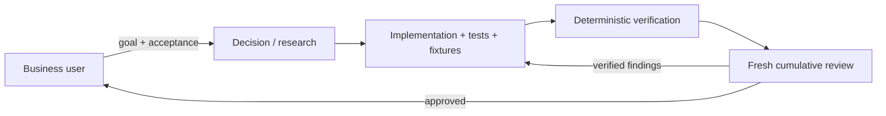

# Agent Operating Model

The project user is a business owner. They define the outcome, target users,
priority, and whether the result solves the problem. Agents own technical
research, architecture, implementation, tests, fixtures, verification, and
technical remediation.

## Roles

| Role | Owns | Preferred routing when supported |
|---|---|---|
| Orchestrator | Scope, repository instructions, artifacts, progress, and user communication | Active coordinating model |
| Decision / research | Repository research, architecture, ambiguous technical decisions, and the implementation plan | Claude Opus or the strongest available reasoning model |
| Implementer | Code, tests, migrations, documentation, and local preview fixtures | Claude Sonnet at high effort or equivalent coding model |
| Verifier | Deterministic build, test, policy, and runtime evidence | Tool-driven |
| Independent reviewer | Cumulative production-readiness and architecture review | Fresh Claude Opus or the strongest available review model |

Where the runtime exposes these named effort controls, decision/research and
Opus review roles use at least `extra`, a Fable reviewer uses `high`, and Sonnet
implementation uses `high`. Never invent or claim a setting the runtime did not
provide.

Model names are preferences, not guarantees. Use explicit role routing only
when the active runtime supports it and report the model truthfully. Otherwise
keep the same role and context boundaries with the active model.

## Do not delegate technical choices to the user

Do not ask the user to choose frameworks, libraries, module boundaries,
database patterns, API mechanics, cache designs, test types, refactoring
strategy, or a fix for a review finding. The decision role chooses the best
option allowed by repository rules and records its evidence and rationale.

Ask the user only when blocked by:

- missing or contradictory business behavior/priority;
- credentials, account authorization, or external access only they can grant;
- destructive or irreversible product/data action;
- a tradeoff with a material business consequence that cannot be inferred.

When a technical choice has a business consequence, ask about that consequence
in business language (for example, acceptable data freshness), not about the
implementation mechanism (for example, Redis versus a database outbox).

## Delivery and review flow

Before engineering handoff or a production-ready claim:

1. Complete the implementation and deterministic checks.
2. Spawn a clean independent reviewer using the strongest available review
   model. Give it the task, acceptance criteria, repository rules,
   `docs/architecture-overview.md`, final tree, and verification evidence.
3. Review the cumulative relevant state, not only the last diff or last fix.
4. The implementer fixes verified material findings and reruns the gates.
5. Spawn a **new clean reviewer** for the next pass.
6. Repeat until approved or genuinely blocked by the allowed user-input cases
   above. Record every pass in the handoff report.

## Local preview

Every user-visible feature must remain demonstrable. When the user says “I want
to see what we have,” “show me,” “run it,” or equivalent, invoke the
`local-preview` skill. Add deterministic, idempotent local-only fixtures when a
meaningful flow otherwise has no data. Never silently replace production
behavior with a mock. Keep fixtures explicitly local/test scoped.

If credentials are required, do not ask the user to paste secrets into chat.
Name the exact variable and safe destination (`.env`, Replit Secrets, or the
target secret manager), then resume after the user confirms it is configured.
