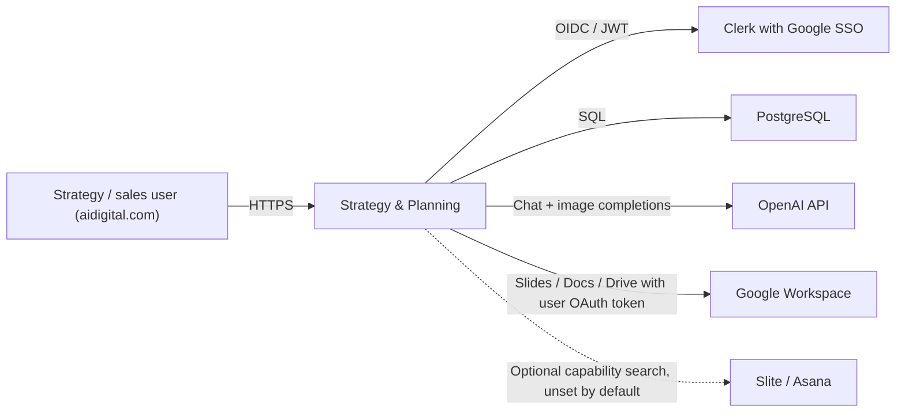
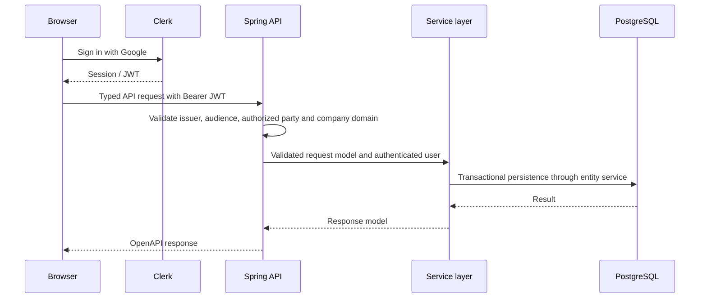
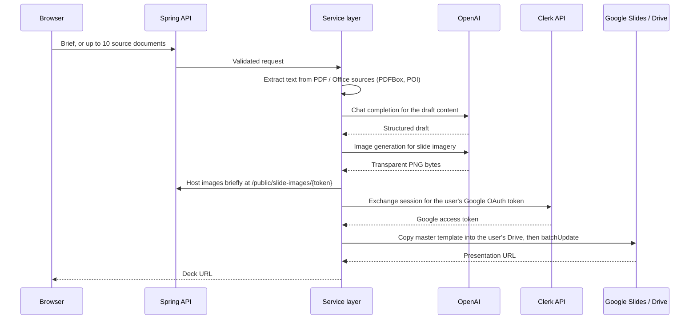

# Strategy & Planning Architecture Overview

This is the canonical description of the product's implemented architecture.
Keep it concise and evidence-based. Update it when a change affects a runtime
boundary, module ownership, data flow, integration, deployment model, or
cross-cutting concern. Detailed engineering rules remain in `.claude/`; do not
duplicate those rulebooks here.

## Document status

- Product owner: @Sheldon Bickel (Slack)
- Tech contact and operational owner: @Azat Nabiev (Slack)
- Lifecycle phase: Engineering
- Last verified against: AIAE convergence migration, coverage finalization
- Verification evidence: `bash scripts/local-verify.sh`
- Cache status: enabled
- MVP usage telemetry: enabled during MVP

## Product and system context

Strategy & Planning is an internal toolkit for AI Digital's strategy and sales
work. It turns source material and short briefs into client-ready Google Slides
decks and Google Docs outlines, and it triages inbound R&D requests. Access is
restricted to `aidigital.com` accounts through Clerk with Google SSO; the same
Google identity supplies the OAuth token used to write decks into the user's own
Drive, so generated artefacts are owned by the person who created them rather
than by a service account.

The application is a React single-page application backed by a Spring Boot
API. The browser uses `BrowserRouter`; application routes resolve through the
SPA fallback when the built frontend is served by Spring Boot.

## Product-specific evidence

- Product capability: generate client-ready case-study decks, category-analysis
  decks, and RFP outline documents from briefs and uploaded source documents,
  and triage inbound R&D requests against a spend threshold
- Primary users: AI Digital strategy and sales staff, restricted to the
  `aidigital.com` email domain
- Primary production flow: user submits a brief or uploads source documents, the
  backend drafts content with OpenAI, then copies a Google Slides or Docs master
  template into the user's Drive and populates it
- Evidence path: `backend/service/src/main/java/com/aidigital/strategyplanning/service/categoryanalysis/services/impl/GoogleDeckServiceImpl.java`
- Evidence path: `frontend/src/features/strategy-toolkit/ui/StrategyToolkit.tsx`

Four product surfaces are implemented, each as a frontend feature module with a
matching backend aggregate:

| Surface | Frontend feature | Backend aggregate |
|---|---|---|
| Case Study Builder | `case-study-builder` | `casestudy` |
| Category Analysis Builder | `category-analysis-builder` | `categoryanalysis` |
| RFP Outline Generator | `rfp-outline-generator` | `rfpoutline` |
| R&D Request Triage | `rnd-request-triage` | `rndrequest` |

`strategy-toolkit` is the home hub that lists the surfaces. R&D Request Triage
is feature-gated by its `available` flag in that hub's `TOOLS` list, and the
router redirects to `/` while the flag is false.

## Runtime and deployment

| Environment | Frontend | Backend | Data |
|---|---|---|---|
| Replit development | Vite development server on 5173 | Spring Boot on 5000 | Replit PostgreSQL |
| Replit deployment | Built SPA served by Spring Boot | Reserved VM, external port 80 to application port 5000 | Replit PostgreSQL |
| Local development | Vite or Docker nginx container | JVM or Docker container on port 8080 | Docker PostgreSQL |

Replit deployment is the production target. Backend and frontend build
independently: the Maven reactor contains no frontend plugin, and
`scripts/replit-build.sh` runs the npm build first, then packages the backend.
The result is one fat jar containing the API, the built SPA, and the Liquibase
changelogs, extracted to an exploded layout so the JVM binds its port inside the
Reserved VM's cold-boot window. `scripts/replit-run.sh` starts that layout with
`-XX:TieredStopAtLevel=1` and `-XX:MaxRAMPercentage=75`; the heap ceiling is
explicit because deck generation holds whole documents in memory.

Backend port 5000 is the single published surface. The Vite dev server stays
internal on 5173 and is deliberately not exposed: publishing it alongside the API
would give the product two origins and let the previewed and deployed apps
diverge. `verify-gates.sh` enforces this.

- Evidence: `backend/application/src/main/resources/application-replit.yml`

## Repository and module boundaries

| Area | Responsibility | May depend on |
|---|---|---|
| `frontend/` | React UI, routing, auth integration, typed API consumption | Generated OpenAPI types and the shared API client |
| `backend/application` | Runtime composition, security, OpenAPI controllers, exception translation, SPA hosting | `service`, runtime infrastructure modules |
| `backend/service` | Business use cases, validation, authorization, orchestration, mapping | Entity services and outbound integration contracts |
| `backend/domain` | JPA entities and repositories | Persistence APIs only |
| `backend/migrations` | Liquibase changelogs | No production Java modules |
| `backend/cache-management` | Generic multi-node cache-invalidation mechanism: registry, DB-outbox polling by monotonic event id, region eviction | Nothing internal — the application supplies the registry, event store, and CacheManagers |
| `backend/event-logging-to-db-feature` | Temporary MVP feedback telemetry; removed at engineering handoff | Application service annotations and PostgreSQL during MVP only |

Controllers implement generated OpenAPI interfaces and delegate to services.
Repositories are accessed only through their paired entity services. Cross-
entity orchestration depends on services, not repositories.

All three canonical boundaries are in place. `backend/observability` owns the
reusable outbound-call instrumentation (`ExternalClientMetricsInterceptor`,
`ExternalCallTimer`). `backend/external-services` owns every third-party client
— OpenAI chat and images, Clerk OAuth, Google Drive/Slides/Docs, and the public
website reader — each created through `PooledRestClientFactory`, so no HTTP
client is constructed inside `backend/service` any more.

- Evidence: `backend/pom.xml`

## Primary runtime flows

### Authenticated API request

### Deck generation with AI drafting

Slide images are served from the public, unauthenticated
`/public/slide-images/{token}` path because Google Slides fetches them
server-side by URL. Tokens are short-lived and carry no user data.

- Evidence: `backend/service/src/main/java/com/aidigital/strategyplanning/service/categoryanalysis/services/impl/OpenAiSlideImageServiceImpl.java`

## API and security boundaries

- OpenAPI YAML is the API source of truth. Backend interfaces and frontend
  types are generated from it.
- Request constraints belong in the OpenAPI contract and are enforced at the
  controller boundary; business validation remains in services/validators.
- Clerk with Google SSO authenticates users. The backend validates JWT issuer,
  signature, audience, authorized party, and the configured company domain
  (`aidigital.com`) through `CompanyEmailDomainAuthorizationManager`.
- `AuthStartupValidator` refuses to start when required auth configuration is
  blank, so a misconfigured deployment fails loudly rather than serving traffic
  without an identity boundary.
- Public paths are limited to the SPA, its static assets, the OpenAPI spec,
  health, and the short-lived slide-image tokens. Everything else requires a
  company-domain JWT.
- Secrets remain in Replit Secrets, local `.env`, or the target secret manager;
  they are never compiled into frontend assets or committed. The Clerk
  publishable key is public by design and is the only key baked into the SPA.

- Authorization is deliberately flat: the only role is "authenticated
  `aidigital.com` user". Every one of the four tools is available to every
  signed-in colleague, and per-user scoping is enforced by data ownership
  instead — each read path queries by `createdBy`, so a caller can only see
  their own case studies, analyses, outlines, and requests. A caller asking for
  another user's row gets "not found" rather than "forbidden", which would
  confirm the row exists.
- There is no admin role and no role table. A `scripts/grant-admin-role.sql`
  helper was inherited from the AIAE operational hub and referenced five
  `hub_*` tables that this schema never creates, so it could only ever have
  failed; it was removed rather than left as an implied plan.

- Evidence: `backend/application/src/main/java/com/aidigital/strategyplanning/security/SecurityConfig.java`

## Data ownership and migrations

- PostgreSQL is the system of record for briefs, drafts, and triage records.
  Generated decks and documents are owned by Google Drive, in the creating
  user's account; the database stores only their identifiers and URLs.
- `backend/migrations` owns eight ordered Liquibase changesets applied from
  `db.changelog-master.xml` at application startup. Changeset `0008` renamed the
  earlier `pov` concept to `rfp-outline`; the old name survives only in that
  changeset's id.
- JPA identifiers use `Long`; schema identifiers use `BIGINT`; unbounded text
  uses PostgreSQL `TEXT`.

Every changeset declares direct `preConditions`, which `check-liquibase-
preconditions` enforces on each build.

- `usage_events` has **no retention window by decision**: the table keeps every
  event and is never trimmed. The product owner accepted unbounded growth in
  exchange for a complete usage history, and no row is migrated or discarded at
  handoff. The consequence is operational, not functional — the table is the
  fastest-growing object in the schema, so disk headroom is what to watch, and
  introducing a retention job later is a product decision rather than a fix.
- The `event-logging-to-db-feature` module is likewise retained past handoff.
  This diverges from the template default, which strips MVP telemetry at
  transfer; the divergence is deliberate so usage measurement survives into
  engineering ownership.

- Evidence: `backend/migrations/src/main/resources/db/changelog/db.changelog-master.xml`

## Caching and consistency

Caching is enabled, and the invalidation mechanism is complete rather than
partial. `backend/cache-management` owns the generic, application-agnostic
protocol: a mutation publishes a `CacheInvalidationEvent` inside the same
database transaction, every node polls the outbox by **monotonic event id** on a
fixed delay, and clears the cache regions registered for the changed class.
Idempotent clears make replay harmless. Timestamp-based polling is forbidden.

The module depends on no other internal module. Three integration points are
supplied outside it: `ApplicationCacheNamesByClassRegistry` (which regions a
tracked class maps to) and `JpaCacheInvalidationEventService` (the transactional
outbox writer) live in `backend/service`, because both need JPA; the
`CacheManager` bridge in `CacheConfig` lives in `backend/application` and
exposes the Hibernate second-level cache so L2 regions are evictable by name.

The outbox table is created by
`db/changelog/changes/0009-cache-invalidation.xml`. Polling, batch bounds,
retention, and registry verification are configured under
`app.cache-management.*`; `@EnableScheduling` on `Application` drives the poll.

The registry is intentionally empty. `ApplicationCacheNamesByClassRegistry`
returns `Map.of()` and nothing calls `publishUpdateEvent`, so the poller runs
and clears nothing. This is a decision, not an omission: no read path in the
product has been measured as a cache candidate, and caching a workload nobody
has profiled buys a staleness class of bug for no proven latency win. The
machinery is kept complete and tested so that enabling it later is a
registration, not a rebuild.

To enable caching for an entity, do both halves together: add its class and its
region names to the registry, and call `publishUpdateEvent` in the same
transaction as the mutation. Registering without publishing yields a cache that
never invalidates.

- Evidence: `backend/cache-management/src/main/java/com/aidigital/strategyplanning/cachemanagement/updater/ScheduledCacheUpdater.java`

## External integrations

| Integration | Purpose | Protocol/authentication | Failure and retry policy |
|---|---|---|---|
| Clerk | User authentication | OIDC/JWT | Fail closed when token validation or required auth configuration fails |
| Clerk Backend API | Exchange the session for the user's Google OAuth token | HTTPS with `CLERK_SECRET_KEY` | Request fails; deck generation surfaces the error to the user |
| OpenAI chat completions | Draft case studies, category analyses, RFP outlines | HTTPS with `OPENAI_API_KEY`, model `gpt-4o` | Blank key means "AI not connected" in the UI; no retry |
| OpenAI image generation | Slide imagery, transparent cutout PNGs | HTTPS with `OPENAI_API_KEY`, model `gpt-image-1` | Deck generation proceeds without imagery |
| Google Slides / Docs / Drive | Copy a master template into the user's Drive and populate it | HTTPS with the end user's Google OAuth token | Request fails; no partial-deck cleanup |
| Slite, Asana | Optional capability search for R&D triage | HTTPS with per-provider token | Unset by default; triage works without them |
| PostgreSQL | Application persistence | JDBC/TLS in managed environments | Transaction rollback; bounded pool (5 connections on Replit) and query timeouts |

Every outbound call goes through `PooledRestClientFactory` in
`backend/external-services`, which gives each provider its own Apache HttpClient
5 pool plus a Micrometer interceptor and a Logbook interceptor. Timeouts come
from `app.external.http.*`; a provider that answers far slower than an ordinary
API call (a long AI completion) overrides only its own response timeout rather
than relaxing the global ceiling. Each client maps provider failures onto a
typed reason — HTTP status, empty content, transport, interrupted — so callers
can word a user-facing message correctly instead of surfacing a bare status.

Two behaviours worth knowing before relying on this in production:

- Apache HttpClient 5 retries `429` and `503` once by default. For a `POST` to a
  billed provider that means the request can genuinely be sent twice. Pinned by
  `OpenAiClientTransportTest`; decide explicitly whether to keep it.
- Every `exchange` call passes `close = true`. Spring closes the response only
  in that case, and each handler reads the whole body before returning. With
  `false` the pooled connection is never released and the pool starves after
  `max-connections-per-route` calls.

`RFP_OUTLINE_TEMPLATE_DOC_ID` is blank by default, so Google Docs export is
inoperative until a template is created.

- Evidence: `backend/external-services/src/main/java/com/aidigital/strategyplanning/external/common/http/PooledRestClientFactory.java`

## Observability and operations

- Structured JSON application logs go to stdout and carry a correlation ID from
  `CorrelationIdFilter`.
- Actuator exposes health, info, and Prometheus metrics.
- Logbook logs HTTP request/response metadata; bodies are excluded and
  sensitive values masked.
- MVP usage telemetry writes to the PostgreSQL `usage_events` table through
  `@LogUsage` and `UsageLoggingAspect`.

- Every outbound provider call is timed and counted by
  `ExternalClientMetricsInterceptor`, tagged with the client name the pool was
  created under (`openai-chat`, `openai-images`, `clerk`, `drive`,
  `google-slides`, `google-docs`, `client-website`).

Operational ownership sits with the tech contact named under "Document status".
What does not exist yet is tooling rather than ownership: there are no
dashboards, alerts, or SLOs, and no documented backup/restore procedure. Metrics
and structured logs are emitted and scrapeable, but nothing consumes them, so a
failure is noticed by a user before it is noticed by a system. Standing these up
is engineering's first operational task and is not a defect in the application.

- Evidence: `backend/application/src/main/java/com/aidigital/strategyplanning/observability/CorrelationIdFilter.java`

## Decisions, constraints, and known risks

| Decision or constraint | Reason | Consequence / follow-up |
|---|---|---|
| Contract-first OpenAPI | One backend/frontend API contract | Generated sources must not be edited |
| BrowserRouter | Real client-side routes with direct-link support | Deployment must preserve SPA fallback behavior |
| Decks are written to the user's own Drive via their Google OAuth token, not a service account | Generated artefacts stay owned and shareable by their author; no service-account key to hold | Deck generation depends on Clerk's Google token exchange; a user without the Google scope cannot generate |
| Master Slides/Docs templates are referenced by hardcoded file ID defaults | The MVP has one canonical template per surface | Template IDs are configuration, not placeholders; changing a template is a config change |
| Slide images are hosted on a public unauthenticated path | Google Slides fetches images server-side by URL | Tokens must stay short-lived and unguessable |
| Java package root is `com.aidigital.strategyplanning`, not a name derived from the repository | Established before the repository was renamed | Do not introduce a second package root to "fix" the mismatch |
| Package `groupId` and repository name disagree | Same history as above | Cosmetic only; renaming would rewrite every Java file |
| Authorization is flat; isolation comes from `createdBy` ownership, not roles | Four internal tools shared by one company-domain team; a role model would add a table and a policy layer nothing needs | Adding a genuine admin capability means designing roles from scratch — there is no dormant role model to switch on |
| The cache-invalidation mechanism ships complete but with an empty registry | No read path has been profiled; caching an unmeasured workload trades correctness risk for an unproven win | Caching is off for every workflow. Enabling it is a registry entry plus a `publishUpdateEvent` call in the same transaction |

The risks carried into the AIAE migration are closed. Each row records what
now holds and the gate or configuration that keeps it true:

| Former risk | Resolution | Enforced by |
|---|---|---|
| No Liquibase changeset declared direct `preConditions` | Every changeset declares them | `check-liquibase-preconditions` |
| Inert L2 cache configuration and a parallel warm-up path | L2 is live through `JCacheRegionFactory` with `missing_cache_strategy: fail`; warm-up is deliberately sequential so startup reads cannot multiply connection demand | `ehcache.xml`, `CacheConfig`, `CacheWarmUpService` |
| Outbound HTTP had no shared pool, timeout, or metrics policy | Every client is built by `PooledRestClientFactory` with per-provider pools, `app.external.http.*` timeouts, Micrometer and Logbook interceptors | `check-production-static-methods`, module boundaries in `backend/pom.xml` |
| Request properties carried no OpenAPI constraint and there were no negative-400 tests | Constraints declared on every request property; negative-400 tests cover each constrained operation | `check-openapi-input-constraints`, `check-api-validation-tests` |
| The frontend had one test, no lint gate, and no DOM test environment | Lint and typecheck gates run in CI; tests run under jsdom | `npm run lint`, `npm run typecheck`, `vitest run --environment jsdom` |
